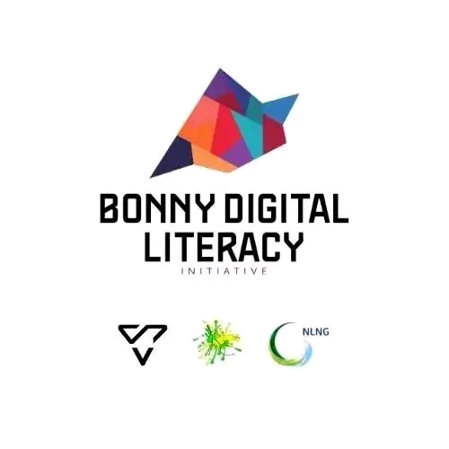

# 🚀 BDLI Cohort 5 – My Learning Journey

## Introduction

My journey with the Bonny Digital Literacy Initiative (BDLI) has been an inspiring and transformative experience. Joining this program gave me the opportunity to explore the world of technology in ways I had never imagined.

During the course of the program, I gained practical knowledge in Web Development, where I learned how websites are created using tools like HTML, CSS and JAVASCRIPT. It was exciting to see how simple lines of code could turn into real websites and digital solutions. We were also introduced to UI/UX Design (Product Design), which helped me understand how to design digital products that are both functional and user-friendly. Through this, I learned how important creativity, problem-solving, and understanding users are when building technology.

Recently, we began learning Robotics, and it has been an amazing experience seeing how technology can interact with the physical world. This stage of the program has further expanded my curiosity and passion for innovation.

Beyond the technical skills, BDLI has helped me develop important qualities such as teamwork, leadership, communication, and critical thinking. Working with other talented participants on projects has taught me how powerful collaboration can be when trying to create solutions that can positively impact our community.

I am truly grateful for the opportunity to learn and grow through this program.

A big thank you to LNG, YRC, and TECHNOVILLE for investing in young people and creating opportunities for us to develop valuable digital skills.

To those who will be joining the next cohort, my advice is simple: come with curiosity, stay dedicated, ask questions, and take advantage of every opportunity the program offers. BDLI is not just about learning technology; it is about building the confidence, mindset, and skills that can shape your future.

 #NLNG #YRC #TECHNOVILLE
